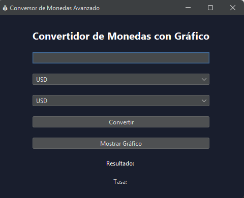

# 💱 Conversor de Monedas Java

Este proyecto es una aplicación de escritorio desarrollada en **Java** que permite **convertir monedas** entre diferentes divisas y visualizar **gráficos estadísticos** del comportamiento histórico de los tipos de cambio.



## 🚀 Características
- Conversión en tiempo real entre monedas
- Visualización de gráficos estadísticos
- Interfaz gráfica amigable (JavaFX o Swing)
- Conexión con base de datos MySQL
- Arquitectura MVC

## 🛠️ Tecnologías utilizadas
- Java 17
- JavaFX / Swing
- MySQL
- Maven

## 📦 Instalación
1. Clona el repositorio:
   ```bash
   git clone https://github.com/paco458/Conversor-de-modedas-java.git
